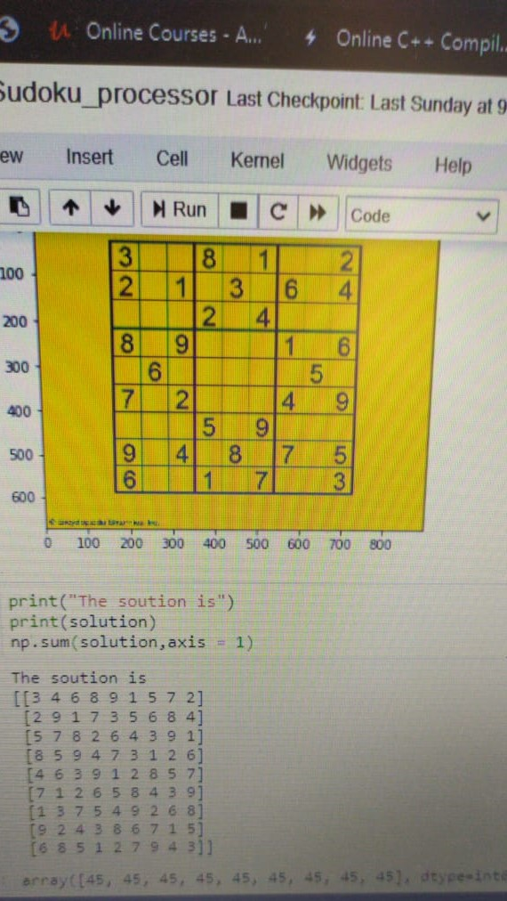

# Sudoku-Solver
## Prerequisites
You need to have installed following softwares and libraries in your machine before running this project.
* Python 3
* Anaconda: It will install ipython notebook and most of the libraries which are needed like sklearn, pandas, seaborn, matplotlib, numpy, scipy.
* Keras: For implementing neural networks
* opencv: For image processing
## Installing
* Python 3: https://www.python.org/downloads/
* Anaconda: https://www.anaconda.com/download/
* opencv: https://sourceforge.net/projects/opencvlibrary/files/4.4.0/opencv-4.4.0-vc14_vc15.exe/download
* Keras: https://pypi.org/project/Keras/
 
## Description
Sudoku is one of the interesting math puzzles known to us. In this tutorial we will see how to solve sudoku using image processing and CNN.

This problem can be divided into 4 stages:-
- Identifying the grid and extarcting the numbers
- Recognising the digits
- Solving the puzzle
- display the solution
Let's see the overview of how things get done

### Identifying the grid and extracting the numbers
First and the most important thing in this problem is to identify the grid. Then only we will be able to get the question. To do so we will use some of the image processing techniques and use opencv for implementing the same. This is the most difficult part of the problem. 
I am going to break this into smaller pieces so that things get done easily
- preprocessing: In this we apply techniques like thresholding, blurring, dilation, inversion to preprocess the image and convert into machine understandable form.
- extracting the outer boundary: In this we detect all contours int the image and find the contour with largest area (sorting) to obtain the outer grid.
- scale and center: In this adjust and reposition the image (individual digits) in the center
- extract the digits: We use the coordinates of the contour and extarct digits and apply scaling and resizing again

### Recognising the digits
This part is very simple. Here we just use MNIST dataset to recognize the digits and create a 2d array to store the puzzle in the memory.
The output after applying stage 1 and stage 2 will be like

If you dont know about the MNIST digit recognitiont then check out <a href="https://github.com/ramakrishnan-21/MNIST-Dataset">this</a> repository.

### Solving the puzzle

This puzzle can be solved by applying the concept of backtracking.But the time complexity is exponential.So I decided to use CNN for this purpose. I knew Sudoku has spatial features since it has a particular arrangement of numbers and CNNs are good at extracting spatial features. 
So I built a simple model which is three layers deep (3,3 conv filter applied 2 times and 1 fully connected layer) and I have uploaded the pre-trained model in the repository. The dataset can be found on <a href="https://www.kaggle.com/bryanpark/sudoku">kaggle</a>

### Display the solution

 ## References
1)  https://medium.com/swlh/how-to-solve-sudoku-using-artificial-intelligence-8d5d3841b872
2) https://aishack.in/tutorials/sudoku-grabber-opencv-plot/
## Authors
Ramakrishnan - Complete work
